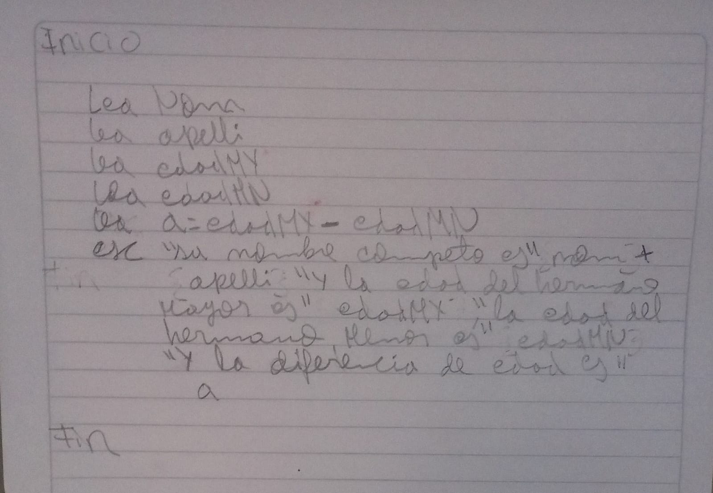

# algoritmo1
desarrollar trabajo asignado por el instructor  en python y dart

<table>
  <tr>
    <td width="40%">
      <!-- Ajusta el width para el tamaño de tu foto -->
      
    </td>
  </tr>
</table>